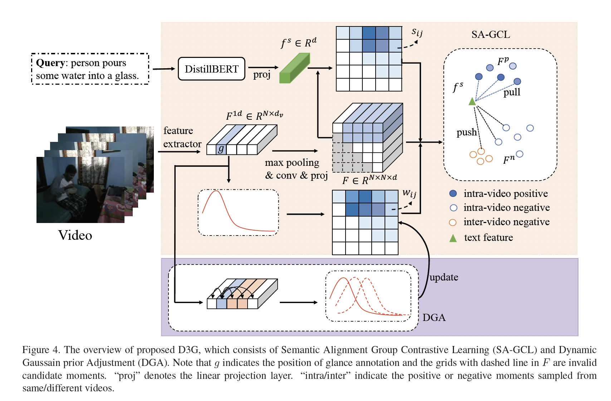

## [ICCV2023] D3G:Exploring Gaussian Prior for Temporal Sentence Grounding with Glance Annotation


### Datasets
- **Annotations**. We adopt the glance annotation released by [ViGA](https://github.com/r-cui/ViGA) for training. Specifically, we adapt the glance annotation to our framework in json format ( see in [dataset](./dataset/) ).
- **Features**. As for video features, we utilize the publicly available [features](https://rochester.app.box.com/s/8znalh6y5e82oml2lr7to8s6ntab6mav) for fair comparison following [MMN](https://github.com/MCG-NJU/MMN).

Please download the video features to directory [dataset](./dataset/) as follows.
```
dataset
├── Charades_STA
│   ├── vgg_rgb_features.hdf5
│   ├── glance_charades_train.json
│   ├── charades_test.json
├── ActivityNet
│   ├── sub_activitynet_v1-3.c3d.hdf5
│   ├── glance_train.json
│   ├── val.json
│   ├── test.json
├── TACoS
│   ├── tall_c3d_features.hdf5
│   ├── glance_train.json
│   ├── val.json
│   ├── test.json
```
### Main Results
#### Charades-STA Dataset
| Method  | Rank1@0.5 | Rank1@0.7 | Rank5@0.5 | Rank5@0.7 |
| :-----: | :-------: | :-------: | :-------: | :-------: | 
|   ViGA  |   36.56   |   16.10   |   48.90   |   25.86   |     
|   [D3G](https://drive.google.com/drive/folders/1CJmWjf1Tf3fBuCQoi3HNHx8eYVcxyHrh)   |   41.64   |   19.60   |   79.25   |   49.30   |  

#### ActivityNet Captions Dataset

| Method  | Rank1@0.3 | Rank1@0.5 | Rank1@0.7 | Rank5@0.3 | Rank5@0.5 | Rank5@0.7 |
| :-----: | :-------: | :-------: | :-------: | :-------: | :-------: | :-------: |
|   ViGA  |   59.78   |   35.39   |   16.25   |   72.19   |   53.19   |   32.69   |
|   [D3G](https://drive.google.com/drive/folders/1CJmWjf1Tf3fBuCQoi3HNHx8eYVcxyHrh)   |   58.25   |   36.68   |   18.54   |   87.84   |   74.21   |   52.47   |

#### TACoS Dataset

| Method  | Rank1@0.3 | Rank1@0.5 | Rank1@0.7 | Rank5@0.3 | Rank5@0.5 | Rank5@0.7 |
| :-----: | :-------: | :-------: | :-------: | :-------: | :-------: | :-------: |
|   ViGA  |   20.82   |   9.52    |   3.10    |   27.92   |   15.35   |   6.10    |
|   [D3G](https://drive.google.com/drive/folders/1CJmWjf1Tf3fBuCQoi3HNHx8eYVcxyHrh)  |   26.99   |   12.62   |   4.77    |   54.71   |   31.59   |   12.10   |

### Training & Inference
```py
cd scipts 
### charades 
sh charades_train.sh # train 
sh charades_test.sh # test 

### activitynet
sh anet_train.sh # train 
sh anet_test.sh # test 

### tacos 
sh tacos_train.sh  # train 
sh tacos_test.sh # test 
```

###
